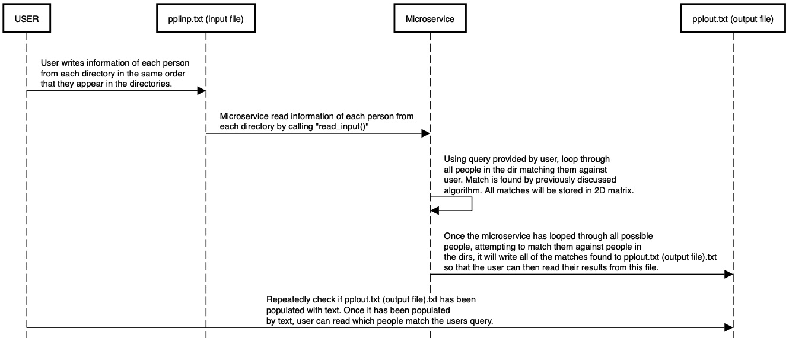

# CS-361-Microservice
This repo will hold a microservice created in CS 361. The microservice will find all similar names given an example name as well as an array of names to search.

# HOW TO REQUEST DATA:

To request data, you will write to the input file (pplinp.txt).
As dicussed previously, the format of the file will need to be as such:

-- START OF FILE --
[ User search query ]
[ Number of directories to search ]
[ Dir name ] [ Number of people in directory ]
[ Person name ]
[ Person description ]
...
...
...
[ Person name ]
[ Person description ]
...
...
...
[ Dir name ] [ Number of people in directory ]
[ Person name ]
[ Person description ]
...
...
...
[ Person name ]
[ Person description ]
-- END OF FILE --

To elaborate on the format given above, the line 'User search query' 
will be line 1 of the file. This line will be the name that the user
is searching for within your program. After this line, you will need
to disclose the number of directories so my program will know the number
of dirs to read. Moving on, the format given (by the program this micro-
service is made for) shows the input format including the dir name
followed by the number of people in the dir. This is so that the
microservice will know how long to read people from the file.
After this, you will have to print a persons name followed by their
description into the file. The microservice knows to read each person
2 lines at a time. You can print up to something like 8192 directories
into the file. Anymore will cause segfaults within the code.

Example Input File:

--FILE START--
Steven
3
Gym 2
Stephen
cool guy
John
also a cool guy
CS361 1
Kaden Fugate
very smart fellow
CS374 3
Stew
tennis player
Even
from Puerto Rico
Raz
ECE major, took ECE 271 with me
--FILE END--

# HOW TO RECIEVE DATA:

To receive data, you will need to read from the output file (pplout.txt).

As previously discussed, the output will be in the following format:

--FILE START--
[ Number of matches found ]
[ Index of persons directory  ] [ Persons index within the directory ]
...
...
...
[ Index of persons directory  ] [ Persons index within the directory ]
--FILE END--

To elaborate on the format above, the file consists of two important parts.
On the first line, will be the amount of matches found given the users input
into pplinp.txt. From here, all of the following lines will contain coordinates
to the position of each person that matched. With this, the user will be able
to quickly access each person that had a name similar to the users search query.

Heres an example of how the output might look:

--FILE START--
2
0 0
2 1
--FILE END--

# UML sequence diagram:

